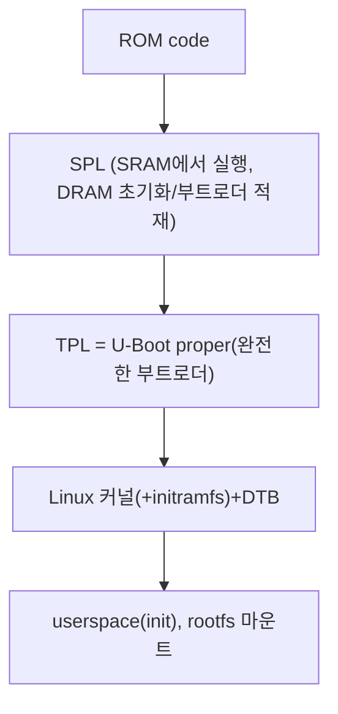

## 부트로더
## 부트로더는 무슨 일을 하는가?
임베디드 리눅스 시스템에서 부트로더는 시스템을 기본 수준(basic level)으로 초기화하고 커널을 로드하는 두 가지 주요 작업을 수행한다. 
전원을 켜거나 리셋한 뒤 부트로더 코드의 첫 줄이 실행됐을 때, 시스템은 아주 최소 상태에 있다. DRAM 제어기는 시작하지 않았으므로 주 메모리에 접근할 수 없다. 마찬가지로, 다른 인터페이스도 구성되지 않았기 때문에 NAND 플레시 제어기, MMC제어기 등을 통해 접근하는 저장소도 사용할 수 없다. 흔히 처음에 동작하는 자원은 하나의 CPU코어와 약간의 온집 정적 메모리, 부트 롬이다.

시스템 부트스트랩은 몇 단계의 코드로 이뤄지고, 각각의 시스템의 더 많은 부분을 작동시킨다. 부트로더의 마지막 동작은 커널을 램에 로드하고 그를 위한 실팽 환경을 만드는 것이다. 부트로더와 커널 사이의 자세한 인터페이스는 아키텍처별로 다르지만, 각각 두 가지 일을 한다. 첫째, 부트로더는 하드웨어 구성 정보를 담고 있는 구조체의 포인터를 전달한다. 둘째, 커널 명령줄의 포인터를 전달한다.

커널 명령줄은 리눅스의 동작을 제어하는 문자열이다. 일단 커널이 실행을 시작하면 부트로더는 더 이상 필요강 없고, 사용하던 모든 메모리를 회수할 수 있다.

부트로더의 부수 작업은 부트 구성을 업데이트하고, 새로운 부트 이미지를 메모리에 로드하고, 진단 기능을 실행하는 유지보수 모드를 제공하는 것이다. 이는 보통 시리얼 인터페이스를 통한 간단한 명령줄 인터페이스로 제어된다.

## 부트 순서

### 1단계: 롬 코드
믿을 만한 외부 메모리가 없으므로, 리셋이나 전원을 켠 직후에 실행되는 코드는 **SoC**의 칩상에 저장해야 한다. 이를 **롬 코드(ROM code)**라고 한다. 롬 코드는 제조 시 칩에 프로그래밍되므로, 비공개(proprietary)이고 오픈소스 대용품으로 대체할 수 없다. DRAM 구성은 장치별로 매우 다르므로, 메모리 제어기를 초기화 하는 코드는 보통 담고 있지 않다. 따라서 매모리 제어기가 필요 없는 **SRAM**(Static Random Access Memory)만 사용할 수 있다.
대부분의 임베디드 **SoC** 설계는 약간의 **SRAM**을 칩 안에 갖고 있는데, 4KB에서 수백 KB까지 다양하다.

롬 코드는 소량의 코드를 사전에 프로그래밍된 몇 개의 위치 중 하나로부터 **SRAM**으로 로드할 수 있다. 예를 들어 **TI OMAP**과 **Sitara**칩은 **NAND** 플래시 메모리의 첫 몇 페이지나 **SPI**(Serial Peripheral Interface)로 연결된 플래시 메모리, **MMC** 장치(eMMC 칩이나 SD 카드 등)의 첫 섹터, **MMC** 장치의 첫 파티션에 있는 **MLO**라는 이름의 파일로붵 코드를 로드하려고 할 것이다. 이들 모든 장치로부터 읽기가 실패하면, 이더넷이나 **USB**, **UART**로부터 바이트 스트림을 읽으려고 할 것이다. 이더넷, **USB**, **UART**는 주로 일반 작업용이 아니라 제조 시에 코드를 플레시 메모리로 로드하는 수단으로 제공된다. 대부분의 임베디드 **SoC**는 비슷한 방식으로 동작하는 롬 코드를 갖고 있다. **SRAM**이 **U-Boot** 같은 완전한 부트로더를 로드할 정도로 충분히 크지 않은 **SoC**에는 **SPL**이라는 중간 로더가 있다.

롬 코드 단계의 끝에서, 롬 코드는 **SPL**코드(SRAM에 존재)의 시작으로 점프한다.

### 2단계: SPL
**SPL**(Secondary Program Loader)은 메모리 제어기와 기타 **TPL**(Tertiary Program Loader)을 **DRAM**에 로드하기 위해 필요한 시스템의 필수적인 부분들을 시작해야 한다. **SPL**의 기능은 크기로 인해 제한된다. 롬 코드처럼 다시 한 번 사전에 프로그래밍된 플래시 장치의 시작부터의 오프셋을 이용해 일련의 저장 장치로부터 프로그램을 읽을 수 있다. **SPL**에 파일시스템 드라이버가 내장돼 있다면, 디스크 파티션에서 u-boot.img처럼 잘 알려진 파일명을 읽일 수 있다. **SPL**은 보통 사용자와의 상호작용을 고려하지 않지만 버전 정보와 진행 메시지를 콘솔로 출력할 수 있다.

**SPL**은 **SRAM** 내에서 실행될 때 **TPL**을 **DRAM**으로 로드한다. 2단계가 끝나면, **SPL**은 **DRAM**에 존재하는 **TPL** 영역으로 점프할 수 있다.

**SPL**은 **Atmel AT91Bootstrap**처럼 오픈소스일 수도 있지만, 제조사가 바이너리로 제공하는 비공개 코드를 담고 있는 것이 매우 일반적이다.

### 3단계: TPL
이제 **U-Boot**같은 완전한 부트로더를 실행할 것이다. 보통 새로운 부트/커널 이미지를 플래시 저장소에 로드하고, 커널을 로드 및 부트하는 등의  유지보수 작업을 수행할 수 있도록 하는 간단한 명령줄 사용자 인터페이스가 있으며, 사용자 개입없이 커널을 자동으로 로드하는 방법이 있다.

**TPL**이 실행되면 커널을 **DRAM**으로 로드한다. 원하는 경우 **DRAM**의 이미지에 **FDT**나 초기 램디스크를 추가할 수 있다. 어느 쪽이든 간에 3단계가 끝나면 메모리에 커널이 존재하며, 시작되기를 기다리고 있다.

일반적으로 임베디드 부트로더는 일단 커널이 실행되면 메모리에서 사라지고 시스템의 동작에 더 이상 관여하지 않는다. 따라서 그렇게 되기 전에 **TPL**은 부트 절차의 제어를 커널로 넘겨야 한다.

## 부트로더에서 커널로 이동
부트로더가 제어를 커널로 넘길 때는 몇 가지 기본 정보를 전당해야 하는데, 다음과 같은 내용이 포함된다.
- 장치 트리가 지원하지 않는 파워PC(PowerPC)와 ARM 플랫폼에서 SoC의 종류를 식별하기 위해 사용하는 기계 번호(machine number)
- 이제까지 발견된 하드웨어의 기본적인 세부 사항(최소한 물리적인 램의 크기와 위치 CPU 클럭 속도 등을 포함한다.)
- 커널 명령줄
- 장치 트리 바이너리의 위치와 크기(선택 사항)
- 초기 램 파일시스템(initramfs)이라고 하는 초기 램 디스크의 위치와 크기(선택 사항)

커널 명령줄은 평범한(암호화되지 않은)아스키 문자열로, 예를 들어 루트 파일시스템을 담고 있는 장치의 이름을 줌으로써 리눅스의 동작을 제어한다.

정보가 전달되는 방식은 아키텍처에 따라 다르고 최근 몇 년 동안 바뀌어왔다. 예를 들어 파워PC의 경우 부트로더가 단순히 보드 정보 구조체의 포인터를 넘긴 반면, **ARM**의 경우 'A tag'목록의 포인터를 넘겼다.

