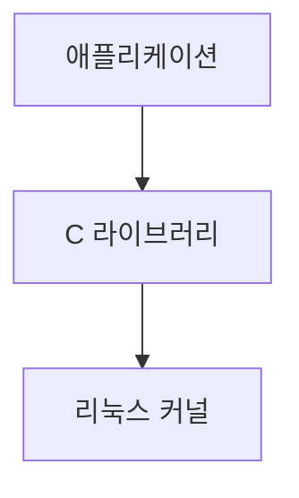
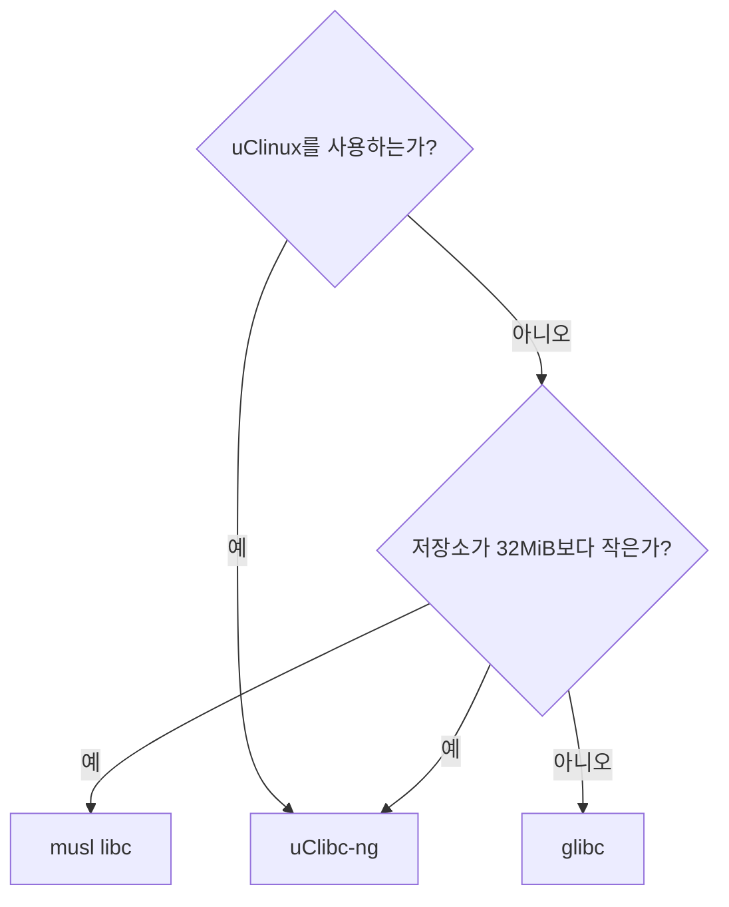

# 툴체인이란?
툴체인은 소스 코드를 타깃 장치에서 실행할 수 있는 실행 파일로, 컴파일러, 링커, 런타임 라이브러리를 포함하는 컴파일 도구들의 집합이다. 리눅스 시스템의 나머지 세 요소(부트로더, 커널, 루트 파일시스템)를 빌드하기 위해 툴체인이 필요하다. 

표준 GNU 툴체인은 세 가지 주요 요소로 이뤄져 있다.

- **Binutils**: 어셈블러와 링커를 포함하는 유틸리티와 집합. [웹 사이트](http://gnu.org/software/binutils)에서 찾을 수 있다.

- **GCC**(GNU Compiler Collection): C와 여러 언어(GCC 버전에 따라 C++, Objective-C, Java, Ada, Fortran, Go 등)를 위한 컴파일러. 공통 백엔드를 사용해 어셈블러 코드를 만들고 GNU 어셈블러로 넘긴다. [웹 사이트](http://gcc.gnu.org)에서 구할 수 있다.

- **C 라이브러리**: POSIX 규격에 기반을 둔 표준 **API**(Application Program Interface). 애플리케이션에서 운영체제 커널로 연결되는 주요 인터페이스이다.

## 툴체인의 종류
우리 입장에서 보면, 두 가지 툴체인이 있다.

- **네이티브**: 툴체인이 만들어내는 프로그램과 같은 종류의 시스템, 때로는 실제로 같은 시스템에서 실행된다. 이는 데스크톱과 서버에서는 일반적인 경우이며, 특정 부류의 임베디드 디바이스 에서는 점점 보편화 되고 있다. 예를 들어, **ARM용** 데비안을 실행하는 라즈베리 파이는 자체적으로 네이티브 컴파일러를 갖고 있다.

- **크로스**: 툴체인이 타깃 기계와 다른 종류의 시스템에서 실행된다. 빠른 데스크톰 PC에서 개발한 다음 임베디드 디바이스에 로드해 테스트할 수 있다.
    - 거의 모든 임베디드 리눅스 개발이 크로스 개발 툴체인을 사용해 이뤄진다. 부분적으로는 대부분의 임베디드 디바이스가 연산 능력, 메모리, 저장 공간이 부족해서 프로그램 개발에 적합하지 않기 때문이지만, 호스트와 타깃 환경을 분리할 수 있기 때문이기도 하다.

## CPU 아키텍처

툴체인은 타깃 CPU의 특징에 맞게 빌드돼야 하는데, CPU의 특징은 다음과 같은 항목으로 나타낼 수 있다.

- **CPU 아키텍처**: ARM, MIPS, x86_64 등

- **빅 엔디언 또는 리틀 엔디언**: 어떤 CPU는 두 가지 모드로 동작할 수 있지만, 기계어 코드가 각각 다르다.

- **부동소수점 지원**: 모든 버전의 임베디드 프로세서가 하드웨어 부동소수점 장치를 구현하지는 않는다. 이 경우 툴체인은 그 대신 소프트웨어 부동소수점 라이브러리를 부르도록 설정될 수 있다.

- **ABI**(Application Binary Interface): 함수 호출 간에 인자를 넘기는 호출 규칙

gcc의 -dumpmachine 옵션을 이용하면 툴체인을 빌드할 때 쓰인 조합을 알 수 있다.
```bash
$ gcc -dumpmachine
```
이는 CPU가 x86_64, 커널이 linux, 사용자 공간이 gnu임을 나타낸다.

크로스 컴파일러를 사용하는 예는 다음과 같다.
```bash
$ mipsel-unknown-linux-gnu-gcc -dumpmachine
```
이는 리틀 엔디언 MIPS CPU, 알려지지 않은 벤더, linux 커널, gnu 사용자 공간을 나타낸다.

## C 라이브러리 고르기

유닉스 운영체제의 프로그래밍 인터페이스는 C 언어로 정의돼 있는데, 지금은 **POSIX**표준으로 정의되어 있다. C라이브러리는 그 인터페이스의 구현으로, 아래 그림에서 볼 수 있듯이 리눅스 프로그램에서 커널로 통하는 관문이다.


C 라이브러리는 커널의 서비스가 필요할 때마다 커널 시스템 호출 인터페이스를 통해 사용자 공간과 커널 공간을 전환한다. C 라이브러리를 거치지 않고 커널 시스템 호출을 바로 할 수도 있지만, 매우 성가시고 거의 그럴 필요가 없다.
고
선택할 수 있는 몇 가지 C 라이브러리가 있는데, 주로 사용하는 것들은 다음과 같다.

- **glibc**: 크기가 크고 최근까지 구성 변경이 용이하지 않지만, **POSIX API**의 가장 완전한 구현이다. 라이선스는 LGPL 2.1이다.

- **musl libc**: musl libc는 비교적 최근에 등장했지만 작고 표준을 준수하는, **GNU libc**의 대안으로 많은 관심을 끌고 있다. 램과 저장 공간의 크기가 제한된 시스템을 위한 좋은 선택이며 MIT 라이선스를 따른다.

- **uClibc-ng**: 처음에는 uClinux용으로 개발했지만, 그 후 완전한 리눅스에서 쓸 수 있도록 개조됐다. 필요에 따라 기능을 미세 조장할 수 있는 구성 유틸리티가 있다. LGPL 2.1을 따른다.

- **eglibc**: glibc를 임베디드용으로 변경한 것으로, eglibc에는 glibc가 다루지 않는 아케틱쳐를 지원하는 구성 옵션이 추가돼 있었다.

uClinux를 쓸 때만 uClibc-ng를 쓰는 것을 권장한다. 저장소나 램의 크기가 제한되어 있다면 musl libc가 좋은 선택이다. 그렇지 않다면 glibc를 주로 쓴다. 정리하며 다음 흐름도와 같다.


미리 빌드된 툴체인이 모든 C 라이브러리를 지원하는 것은 아니므로 C 라이브러리를 선택하면 툴체인 선택이 제한될 수 있다.