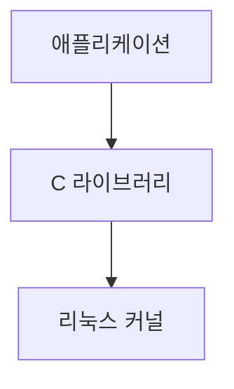
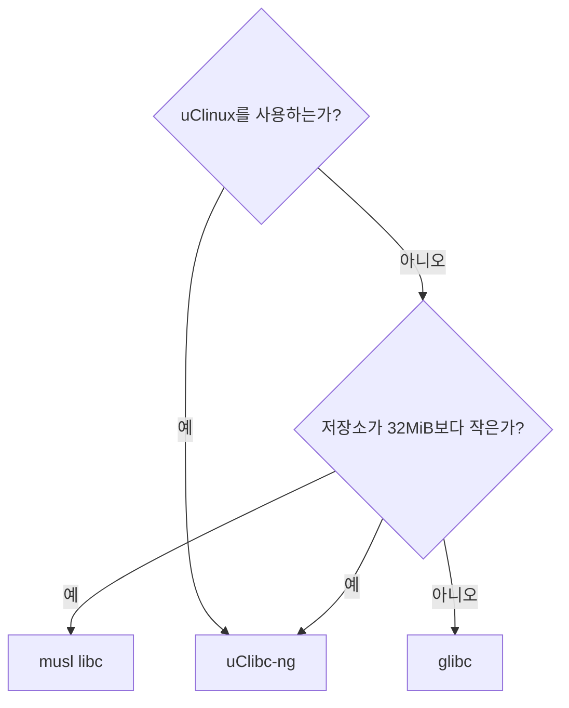

# 툴체인

## 필요 패키지 다운로드
```bash
$ sudo apt-get install autoconf automake bison bzip2 cmake flex g++ gawk gcc gettext git gperf help2man libncurses5-dev libstdc++6 libtool libtool-bin make patch python3-dev rsync texinfo unzip wget xz-utils
```

## 툴체인이란?
툴체인은 소스 코드를 타깃 장치에서 실행할 수 있는 실행 파일로, 컴파일러, 링커, 런타임 라이브러리를 포함하는 컴파일 도구들의 집합이다. 리눅스 시스템의 나머지 세 요소(부트로더, 커널, 루트 파일시스템)를 빌드하기 위해 툴체인이 필요하다. 

표준 GNU 툴체인은 세 가지 주요 요소로 이뤄져 있다.

- **Binutils**: 어셈블러와 링커를 포함하는 유틸리티와 집합. [웹 사이트](http://gnu.org/software/binutils)에서 찾을 수 있다.

- **GCC**(GNU Compiler Collection): C와 여러 언어(GCC 버전에 따라 C++, Objective-C, Java, Ada, Fortran, Go 등)를 위한 컴파일러. 공통 백엔드를 사용해 어셈블러 코드를 만들고 GNU 어셈블러로 넘긴다. [웹 사이트](http://gcc.gnu.org)에서 구할 수 있다.

- **C 라이브러리**: POSIX 규격에 기반을 둔 표준 **API**(Application Program Interface). 애플리케이션에서 운영체제 커널로 연결되는 주요 인터페이스이다.

### 툴체인의 종류
우리 입장에서 보면, 두 가지 툴체인이 있다.

- **네이티브**: 툴체인이 만들어내는 프로그램과 같은 종류의 시스템, 때로는 실제로 같은 시스템에서 실행된다. 이는 데스크톱과 서버에서는 일반적인 경우이며, 특정 부류의 임베디드 디바이스 에서는 점점 보편화 되고 있다. 예를 들어, **ARM용** 데비안을 실행하는 라즈베리 파이는 자체적으로 네이티브 컴파일러를 갖고 있다.

- **크로스**: 툴체인이 타깃 기계와 다른 종류의 시스템에서 실행된다. 빠른 데스크톰 PC에서 개발한 다음 임베디드 디바이스에 로드해 테스트할 수 있다.
    - 거의 모든 임베디드 리눅스 개발이 크로스 개발 툴체인을 사용해 이뤄진다. 부분적으로는 대부분의 임베디드 디바이스가 연산 능력, 메모리, 저장 공간이 부족해서 프로그램 개발에 적합하지 않기 때문이지만, 호스트와 타깃 환경을 분리할 수 있기 때문이기도 하다.

### CPU 아키텍처

툴체인은 타깃 CPU의 특징에 맞게 빌드돼야 하는데, CPU의 특징은 다음과 같은 항목으로 나타낼 수 있다.

- **CPU 아키텍처**: ARM, MIPS, x86_64 등

- **빅 엔디언 또는 리틀 엔디언**: 어떤 CPU는 두 가지 모드로 동작할 수 있지만, 기계어 코드가 각각 다르다.

- **부동소수점 지원**: 모든 버전의 임베디드 프로세서가 하드웨어 부동소수점 장치를 구현하지는 않는다. 이 경우 툴체인은 그 대신 소프트웨어 부동소수점 라이브러리를 부르도록 설정될 수 있다.

- **ABI**(Application Binary Interface): 함수 호출 간에 인자를 넘기는 호출 규칙

gcc의 -dumpmachine 옵션을 이용하면 툴체인을 빌드할 때 쓰인 조합을 알 수 있다.
```bash
$ gcc -dumpmachine
```
이는 CPU가 x86_64, 커널이 linux, 사용자 공간이 gnu임을 나타낸다.

크로스 컴파일러를 사용하는 예는 다음과 같다.
```bash
$ mipsel-unknown-linux-gnu-gcc -dumpmachine
```
이는 리틀 엔디언 MIPS CPU, 알려지지 않은 벤더, linux 커널, gnu 사용자 공간을 나타낸다.

### C 라이브러리 고르기

유닉스 운영체제의 프로그래밍 인터페이스는 C 언어로 정의돼 있는데, 지금은 **POSIX**표준으로 정의되어 있다. C라이브러리는 그 인터페이스의 구현으로, 아래 그림에서 볼 수 있듯이 리눅스 프로그램에서 커널로 통하는 관문이다.


C 라이브러리는 커널의 서비스가 필요할 때마다 커널 시스템 호출 인터페이스를 통해 사용자 공간과 커널 공간을 전환한다. C 라이브러리를 거치지 않고 커널 시스템 호출을 바로 할 수도 있지만, 매우 성가시고 거의 그럴 필요가 없다.
고
선택할 수 있는 몇 가지 C 라이브러리가 있는데, 주로 사용하는 것들은 다음과 같다.

- **glibc**: 크기가 크고 최근까지 구성 변경이 용이하지 않지만, **POSIX API**의 가장 완전한 구현이다. 라이선스는 LGPL 2.1이다.

- **musl libc**: musl libc는 비교적 최근에 등장했지만 작고 표준을 준수하는, **GNU libc**의 대안으로 많은 관심을 끌고 있다. 램과 저장 공간의 크기가 제한된 시스템을 위한 좋은 선택이며 MIT 라이선스를 따른다.

- **uClibc-ng**: 처음에는 uClinux용으로 개발했지만, 그 후 완전한 리눅스에서 쓸 수 있도록 개조됐다. 필요에 따라 기능을 미세 조장할 수 있는 구성 유틸리티가 있다. LGPL 2.1을 따른다.

- **eglibc**: glibc를 임베디드용으로 변경한 것으로, eglibc에는 glibc가 다루지 않는 아케틱쳐를 지원하는 구성 옵션이 추가돼 있었다.

uClinux를 쓸 때만 uClibc-ng를 쓰는 것을 권장한다. 저장소나 램의 크기가 제한되어 있다면 musl libc가 좋은 선택이다. 그렇지 않다면 glibc를 주로 쓴다. 정리하며 다음 흐름도와 같다.


미리 빌드된 툴체인이 모든 C 라이브러리를 지원하는 것은 아니므로 C 라이브러리를 선택하면 툴체인 선택이 제한될 수 있다.

--- 

## crosstool-NG 를 이용해 툴체인 빌드하기

### crosstool-NG Install

```bash
$ git clone https://github.com/crosstool-ng/crosstool-ng.git
$ cd crosstool-ng
$ ./bootstrap 
$ ./configure --prefix=${PWD}
$ make
$ make install
```

### QEMU용 툴체인 빌드

```bash
# crosstool-NG 작업 디렉터리를 “처음 받은 상태”로 리셋하는 명령
$ bin/ct-ng distclean
$ bin/ct-ng arm-unknown-linux-gnueabi
$ bin/ct-ng build
```

### 툴체인의 구조

툴체인이 `~/x-tools/arm-unknown-linux-gnueabi/bin`안에 있는데 그 안에서 크로스 컴파일러 `arm-unknown-linux-gnueabi-gcc`를 찾을 수 있다. 이 컴파일러를 사용하려면, 다음 명령으로 해당 디렉터리를 패스에 넣어야 한다.
```bash
$ PATH=~/x-tools/arm-unknown-linux-gnueabi/bin:$PATH
```

이제 C언어로 작성된 `helloworld.c` 프로그램을 다음과 같이 컴파일할 수 있다.
```bash
$ arm-unknown-linux-gnueabi-gcc helloworld.c -o helloworld
```

file명령으로 파일의 종류를 출력해보면 크로스 컴파일됐음을 확인할 수 있다.
```bash
$ file helloworld
```


### 크로스 컴파일러를 알아보자

버전 보는 방법
```bash
$ arm-unknown-linux-gnueabi-gcc --version
```

어떻게 구성됐는지 알고 싶으면 -v를 쓴다
```bash
$ arm-unknown-linux-gnueabi-gcc -v
```
많은 양이 출력되는데 특별히 언급할 만한 것들은 다음과 같다.

-  `--with-sysroot=/home/ubuntu03/x-tools/arm-unknown-linux-gnueabi/arm-unknown-linux-gnueabi/sysroot`: 이건은 기봇 sysroot 디렉터리로, 나중에 자세히 설명하겠다.

- `--enable-languages=c,c++`: 이를 이용해 C와 C++을 활성화한다.

- `--enable-threads=posix`: POSIX 스레드를 사용한다.

`--target-help`를 사용해서 아키텍처별로 사용 가능한 옵션들을 출력할 수 있다.
```bash
$ arm-unknown-linux-gnueabi-gcc --target-help
```

### SYSROOT, 라이브러리, 헤더 파일
툴체인 sysroot는 라이브러리, 헤더 파일, 기타 구성 파일들을 위한 서브디렉터리들을 담고 있는 디렉터리다. 툴체인을 구성할 때 `--with-sysroot=`로 설정하거나 명령줄에서 `--sysroot=`로 설정할 수 있으며, `-print-sysroot`로 기본 sysroot의 위치를 볼 수 있다.
```bash
$ arm-unknown-linux-gnueabi-gcc -print-sysroot /home/ubuntu03/x-tools/arm-unknown-linux-gnueabi/arm-unknown-linux-gnueabi/sysroot
```
sysroot 안에는 다음과 같은 서브디렉터리들이 있다.
- `lib`: C 라이브러리용 공유 오브젝트 파일들과 동적 링커/로더인 ld-linux
- `usr/lib`: C 라이브러리용 정적 라이브러리 아카이브와 추후에 설치되는 기타 라이브러리
- `usr/include`: 모든 라이브러리의 헤더들
- `usr/bin`: ldd 명령 같은, 타깃에서 실행되는 유틸리티 프로그램들
- `/usr/share`: 지역화와 국제화를 위해 사용된다.
- `sbin`: 라이브러리 로드 경로를 최적화하는 데 사용되는 ldconfig 유틸리티를 제공한다.

### 툴체인 안의 다른 도구들
다음은 GNU 툴체인 안의 여러 요소를 호출하는 명령과 설명의 목록이다.
- `add2line`: 실행 파일 안의 디버그 심볼을 읽어서 프로그램 주소를 파일명과 행 번호로 변환한다. 시스템 크래시 리포트(system crash report)에 출력된 주소를 해독할 때 매우 유용하다.
- `ar`: 아카이브 유틸리티는 정적 라이브러리를 만들 때 쓰인다.
- `as`: GNU 어셈블러
- `c++filt`: C++과 자바 심볼을 복원(demangle)할 때 쓰인다.
- `cpp`: C 전처리기로, `#define`, `#include`등의 지시자를 확장할 때 쓰인다. 단독으로 사용할 필요는 거의 없다.
- `elfedit`: ELF파일의 ELF헤더를 갱신할 때 쓰인다.
- `g++`: GNU C++ 프론트엔드로, 소스파일이 C++ 코드를 담고 있다고 가정한다.
- `gcc`: GNU C 프론트엔드로, 소스파일이 C 코드를 담고 있다고 가정한다.
- `gcov`: 코드 커버리지 도구
- `gdb`: GNU 디버거
- `gprof`: 프로그램 프로파일링 도구
- `ld`: GNU 링커
- `nm`: 오브젝트 파일의 심볼을 나열한다.
- `objcopy`: 오브젝트 파일을 복사하고 번역할 때 쓰인다.
- `objdump`: 오브젝트 파일의 정보를 출력할 때 쓰인다.
- `ranlib`: 정적 라이브러리 안의 인덱스를 만들거나 수정해 링크 단계를 더 빠르게 한다.
- `readlf`: ELF 오브젝트 형식의 파일에 정보를 출력한다.
- `size`: 섹션 크기와 전체 크기를 나열한다.
- `string`: 파일 안의 인쇄 가능 문자열들을 출력한다.
- `strip`: 오브젝트 파일의 디버그 심볼 테이블을 없애 파일 크기를 줄여준다. 흔히 타깃에 복사할 모든 실행 코드에 적용한다.

### C 라이브러리의 요소를 살펴보자
C 라이브러리는 라이브러리 파일 하나가 아니며, POSIX API를 구현하는 4개의 주요 부분으로 이뤄져 있다.
- `libc`: printf, open, close, read, write등 잘 알려진 POSIX함수들을 담고 있는 주 C 라이브러리
- `libm`: cos, exp, log 같은 수학 함수들
- `libpthread`: 이름이 pthread_로 시작하는 모든 POSIX 스레드 함수들
- `librt`: 공유 메모리와 비동기 I/O를 포함하는 POSIX 실시간 확장
첫 번째 항목인 libc는 언제나 링크되지만, 나머지는 -l 옵션으로 명시적으로 링크해야 한다. -l의 인자는 라이브러리 이름에서 lib을 뺀 것이다. 그러므로, 예를 들어 sin()을 불러서 사인 함수를 계산하는 프로그램을 -lm을 통해 libm과 링크해야 한다.
```bash
$ arm-unknown-linux-gnueabi-gcc hello.c -o hello -lm
```
readelf 명령으로 이 프로그램이나 다른 프로그램이 어떤 라이브러리와 링크됐는지 확인할 수 있다.
```bash
$ arm-unknown-linux-gnueabi-readelf -a hello | grep "Shared library"
```
공유 라이브러리는 런타임 링커가 필요한데, 다음 명령으로 알 수 있다.
```bash
$ arm-unknown-linux-gnueabi-readelf -a hello | grep "program interpreter"
```

## 라이브러리와 링크하기: 정적 링크와 동적 링크
리눅스용으로 작성하는 모든 프로그램은 C로 작성됐든 상관없이 C라이브러리인 libc와 링크될 것이다. 이것은 너무나 기본적이라서 gcc나 g++에게 지사할 필요도 없다. gcc/g++은 언제나 libc와 링크하며, 링크하고 싶은 다른 라이브러리는 -l옵션을 통해 명시적으로 지정해야 한다.

## QEMU와 Raspberry pi 4에서의 실행

### 커널/유저랜드 아키텍처와 비트수를 확인
- `uname -m` → 커널이 어떤 아키인지
- `dpkg --print-architecture`→ 유저랜드(패키지) 아키텍처가 뭔지
- `getconf LONG_BIT` → 지금 프로세스/유저랜드가 32/64비트 중 무엇인지
```bash
uname -m
# aarch64  → 64비트 ARM 커널
# armv7l   → 32비트 ARM 커널
# x86_64   → 64비트 x86 커널
# i686     → 32비트 x86 커널

dpkg --print-architecture
# arm64    → 64비트 ARM 유저랜드(패키지 아키)
# armhf    → 32비트 ARM(하드플로트) 유저랜드
# amd64    → 64비트 x86 유저랜드
# i386     → 32비트 x86 유저랜드

getconf LONG_BIT
# 64       → 현재 유저랜드(프로세스)가 64비트
# 32       → 현재 유저랜드(프로세스)가 32비트
```

| 항목            | **apt 툴체인** (예: `gcc-aarch64-linux-gnu`, `crossbuild-essential-armhf`) | **ct-ng 툴체인**                           |
| ------------- | ---------------------------------------------------------------------- | --------------------------------------- |
| 설치 속도         | **매우 빠름**, 바로 사용                                                       | **빌드 필요**, 수십 분\~                       |
| 유지보수          | 배포판 업데이트로 자동                                                           | **버전 고정**, 업데이트는 **재빌드**                |
| 커스터마이즈        | 제한적(배포판 기본 구성)                                                         | **매우 자유로움**(GCC/binutils/C 라이브러리/튜닝 모두) |
| 정적 링크/작은 바이너리 | 글리бc 정적은 제약·크기 ↑                                                       | **musl/uClibc-ng 선택**으로 정적·소형화 유리       |
| 재현성           | 배포판 변화 영향                                                              | **.config**로 **완전 재현**                  |
| 멀티타깃/멀티립      | 기본 제공 범위 한정                                                            | **원하는 multilib** 구성 가능                  |
| 경로/충돌         | `/usr/bin`에 설치, 시스템과 혼재                                                | `~/x-tools/<triplet>` **격리** 설치(충돌 적음)  |
| 언제 쓰나  | **지금 당장 결과**가 필요할 때              | **BSP/펌웨어/정적링크/musl** 등 세밀 제어 필요할 때     |

1. apt 방식 (가장 빠른 실전용)
    - RPi4에서 표준 배포판(RPi OS 64-bit/Ubuntu arm64) 를 쓸 때
    - 지금 바로 aarch64/armhf 바이너리가 필요할 때
    - CI에 쉽게 올리고, 시스템 업데이트 따라가고 싶을 때

2. 커스터마이즈( ct-ng ) 방식 (깊게 파는 용)
    - GLIBC 버전 고정, musl/uClibc-ng로 바꾸기, 정적 링크 친화 환경, 튜닝 옵션(armv8-a, cortex-a72, FPU 세팅, LTO, gold/ld.bfd 선택) 등 세밀 제어가 필요할 때
    - reproducible build, 사내 배포용 툴체인 아카이브가 필요할 때

- 학습/빠른 개발/일반 앱(표준 배포판 arm64/armhf)
    - → apt 권장 (예: gcc-aarch64-linux-gnu 또는 gcc-arm-linux-gnueabihf)
    - → RPi/VM에서 /lib, /usr rsync 받아 --sysroot 맞추면 충분히 안정적.

- BSP/펌웨어, 제품화, 크기 최적화, musl/정적 링크, 버전 고정
    - → ct-ng 권장 (예: ct-ng aarch64-unknown-linux-gnu 또는 ct-ng arm-unknown-linux-gnueabihf)
    - → 필요시 musl 선택, -mcpu=cortex-a72 등 디폴트 튠 내장, multilib 구성.

### QEMU에서(CLI) 실행방법

1. 동적 링크 그대로 실행
```bash
# 방법 1: 실행할 때 -L 옵션으로 런타임 경로 지정
$ qemu-arm -L /usr/arm-linux-gnueabi ./helloworld

# 방법 2: 자주 쓸 거면 환경변수로 고정
$ export QEMU_LD_PREFIX=/usr/arm-linux-gnueabi
$ ./helloworld
```
체크 팁
- `file ./helloworld` → ARM 32-bit, interpreter `/lib/ld-linux.so.3` 확인
- `qemu-arm -L /usr/arm-linux-gnueabi /usr/arm-linux-gnueabi/lib/ld-linux.so.3 --list ./helloworld` 로 의존성 보기

2. 정적 링크로 더 단순하게
```bash
$ arm-unknown-linux-gnueabi-gcc -static helloworld.c -o helloworld_static
$ ./helloworld_static
```
정적 링크로 빌드하면 바이너리 크기가 극적으로 증가한다.

B. GUI에서 실행 (QEMU 시스템모드: 데스크탑 창 + scp)

```bash
# 우분투 패키지로 ARM64 크로스컴파일러 설치
$ sudo apt install -y gcc-aarch64-linux-gnu
$ aarch64-linux-gnu-gcc hello.c -o hello64
```

```bash
$ scp -P 2222 -r /home/ubuntu03/embedded_linux ubuntu@127.0.0.1:~
$ ssh -p 2222 ubuntu@127.0.0.1
$ cd embedded_linux
$ ./hello64
```

### Raspberry pi 4 실행방법
```bash
# arm 32bit
$ sudo apt install crossbuild-essential-armhf
$ arm-linux-gnueabihf-gcc hello.c -o hello32
$ scp hello32 pi@192.168.0.89:/home/pi
```

## 크로스 컴파일 기술
흔히 쓰이는 빌드 시스템
- 툴체인이 주로 make 변수 CROSS_COMPLIE로 제어되는 순수한 makefile들
- Autotools로 알려진 GNU 빌드 시스템
- CMake

Autotools와 makefile은 심지어 기본 임베디드 리눅스 시스템을 구축하는 데도 필요하다. CMake는 크로스 플랫폼이며, 특히 C++ 커뮤니티에서 수년에 걸쳐 채택이 증가했다.

### 단순 makefile
리눅스 커널, U-Boot 부트로더, Busybox를 포함한 몇몇 중요한 패키지는 크로스 컴파일이 매우 쉽다. 각각을 컴파일할 때 make 변수 CROSS_COMPLIE에 툴체인 접두어(예: arm-linux-gnueabihf-)를 넣기만 하면 된다.
따라서 Busybox를 컴파일할 때는 다음같이 입력한다.
```bash
$ make CROSS_COMPLIE=aarch64-linux-gnu-
```

### CMake
```bash
# 없다면 설치
$ sudo apt update
$ sudo apt install -y cmake build-essential
```
CMake는 소프트웨어를 빌드하기 위해 기본 플랫폼의 기본 도구에 의존한다는 점에서 메타 빌드 시스템에 가깝다.
```bash
# CMakeLists.txt 생성
$ cat > CMakeLists.txt <<'EOF'
cmake_minimum_required(VERSION 3.16)
project(hello C)
add_executable(hello hello.c)
install(TARGETS hello RUNTIME DESTINATION bin)
EOF
```
기본 리눅스 운영체제용 패키지를 구성하고 빌드하고 설치하려면, 다음 명령을 실행한다.
```bash
$ cmake .
$ make
$ sudo make install
```
리눅스에서 네이티브 빌드 도구는 GNU make 이므로 CMake는 디폴트로 빌드에 사용할 makeflie을 생성한다.